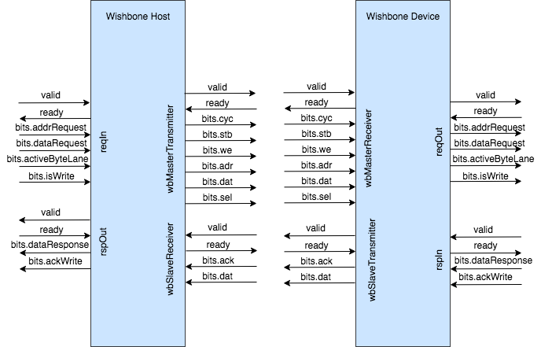

Bus Specific Implementation
===========================

This guide will cover the bus specific implementations that needs to be done by taking the already implemented
Wishbone protocol as an example.

Each bus specific protocol should have a *Host Adapter* and a *Device Adapter*. The host behaves like the master of
the bus while the device acts as the slave of the bus.

In the case of Wishbone implementation, it also has a ``WishboneHost`` adapter and a ``WishboneDevice`` adapter.

Furthermore, each protocol should have a *Master Bundle* that is concerned with the *Host Adapter* and a *Slave Bundle*
that is concerned with the *Device Adapter*.

These bundles and adapters can then be parameterized with a common *Config* class that is passed down to each module.

Wishbone Example
----------------

This example will provide a brief overview regarding how the implementation of Wishbone protocol is done and might
help to think about implementing other protocols in a similar manner.

Creating the configuration class
^^^^^^^^^^^^^^^^^^^^^^^^^^^^^^^^

The ``WishboneConfig`` class is created here: ``main/scala/caravan/bus/wishbone/WishboneConfig.scala``

.. code-block:: scala

    case class WishboneConfig
    (
    /**
    * addressWidth: the address width in bits
    * dataWidth: the data width in bits
    * granularity: the minimal data transfer size over the bus
    * waitState: whether the host can produce wait states during the bus transfer cycle
    */
    addressWidth: Int,
    dataWidth: Int,
    granularity: Int = 8,
    waitState: Boolean = false
    ) extends BusConfig

This config class extends the ``BusConfig`` trait that is declared here: ``main/scala/caravan/bus/common/Transaction.scala``

This class is then *implicitly* passed down to the different wishbone module in order to parameterize them.

Creating the master and slave bundles
^^^^^^^^^^^^^^^^^^^^^^^^^^^^^^^^^^^^^

As discussed above, each bus protocol should have a *master bundle* that is concerned with the *host adapter*
and a *slave bundle* that is concerned with the *device adapter*. These bundles are defined in the following file:
``main/scala/caravan/bus/wishbone/WishboneBus.scala``

.. code-block:: scala

    class WishboneMaster(implicit val config: WishboneConfig) extends WBHost {
        /**
        * cyc ->  indicates that a valid bus cycle is in progress
        * stb ->  indicates a valid data transfer cycle
        * we ->  indicates whether the current bus cycle is a READ or WRITE cycle
        * adr ->  carries the address for the current bus cycle
        * dat ->  contains the data output from the master
        * sel -> the sel output which indicates where valid data lane is expected on the dat_i for READs or dat_o for WRITEs
        * */
        val cyc        = Bool()
        val stb        = Bool()
        val we         = Bool()
        val adr        = UInt(config.addressWidth.W)
        val dat        = UInt(config.dataWidth.W)
        val sel        = UInt((config.dataWidth/config.granularity).W)
    }

    class WishboneSlave(implicit val config: WishboneConfig) extends WBDevice {
        /**
        * ack ->  indicates a normal termination of bus cycle
        * dat ->  contains the data output from the slave
        * err ->  indicates an error termination of bus cycle
        */
        val ack = Bool()
        val dat = UInt(config.dataWidth.W)
        val err = Bool()
    }

Note that these classes do not extend the ``Bundle`` type. This is due to the fact that ``WBHost`` and ``WBDevice``
themselves extends ``BusHost`` and ``BusDevice`` which finally extends the ``Bundle`` type.

The ``BusHost`` and ``BusDevice`` classes are defined here: ``main/scala/caravan/bus/common/Transaction.scala``

.. code-block:: scala

    class BusHost extends Bundle
    class BusDevice extends Bundle

The ``WBHost`` and ``WBDevice`` then extend them in the Wishbone specific implementation file:
``main/scala/caravan/bus/wishbone/WishboneBus.scala``.

.. code-block:: scala

    case class WBHost() extends BusHost
    case class WBDevice() extends BusDevice

The reason for creating this hierarchy is to use *type parameterization* effectively. One example of this is found in
the implementation of the *1:N Switch* present in ``main/scala/caravan/bus/common/Switch1ToN.scala``

Creating the host and device adapters
^^^^^^^^^^^^^^^^^^^^^^^^^^^^^^^^^^^^^

Once the protocol specific master and slave bundles are ready, the adapters can be created.

Here is how the two adapters look next to each other:

The ``WishboneHost`` adapter is created here: ``main/scala/caravan/bus/wishbone/WishboneHost.scala``

.. code-block:: scala

    class WishboneHost(implicit val config: WishboneConfig) extends HostAdapter {
        val io = IO(new Bundle {
            val wbMasterTransmitter = Decoupled(new WishboneMaster())
            val wbSlaveReceiver  = Flipped(Decoupled(new WishboneSlave()))
            val reqIn = Flipped(Decoupled(new Request()))
            val rspOut = Decoupled(new Response())
        })

        // protocol specific logic here
    }

The host is not extended with ``Module`` rather it is extended by ``HostAdapter`` which is an abstract class
that itself extends ``Module``. This also follows for the ``WishboneDevice`` which extends ``DeviceAdapter``
rather than ``Module``. These abstract classes are present here: ``main/scala/caravan/bus/common/Transaction.scala``

.. code-block:: scala

    abstract class DeviceAdapter extends Module
    abstract class HostAdapter extends Module

The implementation details are protocol specific and are not shown here. However, the important thing to note are the
interfaces. As discussed, the host adapter needs to communicate with the user's IP as well as with the wishbone slave.

It has a ``wbMasterTransmitter`` interface to send requests to the wishbone slave and a ``wbSlaveReceiver``
to receive the response from the wishbone slave.

It also has a ``reqIn`` and ``rspOut`` interface to receive the request from the user's IP and send the response back
respectively.

The ``WishboneDevice`` adapter is created here: ``main/scala/caravan/bus/wishbone/WishboneDevice.scala``

.. code-block:: scala

    class WishboneDevice(implicit val config: WishboneConfig) extends DeviceAdapter {
        val io = IO(new Bundle {
            val wbSlaveTransmitter = Decoupled(new WishboneSlave())
            val wbMasterReceiver = Flipped(Decoupled(new WishboneMaster()))
            val reqOut = Decoupled(new Request())
            val rspIn = Flipped(Decoupled(new Response()))
        })

        // protocol specific logic here
    }

The ``WishboneDevice`` acts in an opposite direction, i.e it receives the host adapter's request through the
``wbMasterReceiver`` interface and sends back the response through the ``wbSlaveTransmitter`` interface.

This time it uses the ``reqOut`` interface to send the request to the user's IP `(this maybe some peripheral registers
or memory)` and receives the ``rspIn`` back from the user's IP `(which then is sent back as a response to the
host adapter)`.

Creating the Harness
^^^^^^^^^^^^^^^^^^^^

The testing harness is created to connect the adapters together and verify the correct functionality. In this harness
a single point-point interconnection scheme based on wishbone is tested. The host adapter would communicate with
the user's IP (in our case the test-bench stimuli for now) and the device adapter would also communicate with the user's
IP (a dummy memory that we created in the harness itself).

.. image:: ../images/harness.png

The dummy memory interface is implemented inside the harness here: ``main/scala/caravan/bus/wishbone/Harness.scala``

.. code-block:: scala

    class DummyMemController(programFile: String)(implicit val config: WishboneConfig) extends Module {
        val io = IO(new Bundle {
            val req = Flipped(Decoupled(new Request()))
            val rsp = Decoupled(new Response())
        })

        // implementation specific logic
    }

The ``Harness`` module is created here as well: ``main/scala/caravan/bus/wishbone/Harness.scala``

.. code-block:: scala

    class Harness(programFile: String)(implicit val config: WishboneConfig) extends Module {
        val io = IO(new Bundle {
            val valid = Input(Bool())
            val addrReq = Input(UInt(config.addressWidth.W))
            val dataReq = Input(UInt(config.dataWidth.W))
            val byteLane = Input(UInt((config.dataWidth/config.granularity).W))
            val isWrite = Input(Bool())

            val validResp = Output(Bool())
            val dataResp = Output(UInt(32.W))
        })

        val wbHost = Module(new WishboneHost())
        val wbSlave = Module(new WishboneDevice())
        val memCtrl = Module(new DummyMemController(programFile))

        wbHost.io.rspOut.ready := true.B  // IP always ready to accept data from wb host

        wbHost.io.wbMasterTransmitter <> wbSlave.io.wbMasterReceiver
        wbSlave.io.wbSlaveTransmitter <> wbHost.io.wbSlaveReceiver

        wbHost.io.reqIn.valid := Mux(wbHost.io.reqIn.ready, io.valid, false.B)
        wbHost.io.reqIn.bits.addrRequest := io.addrReq
        wbHost.io.reqIn.bits.dataRequest := io.dataReq
        wbHost.io.reqIn.bits.activeByteLane := io.byteLane
        wbHost.io.reqIn.bits.isWrite := io.isWrite

        wbSlave.io.reqOut <> memCtrl.io.req
        wbSlave.io.rspIn <> memCtrl.io.rsp

        io.dataResp := wbHost.io.rspOut.bits.dataResponse
        io.validResp := wbHost.io.rspOut.valid

    }

