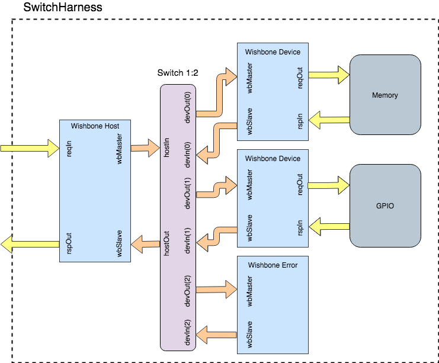

Development Setup
=================

Prerequisite
------------

JDK 8 or newer
^^^^^^^^^^^^^^
It is recommended to use Java 8 and Java 11 releases. You can install the JDK as recommended by your
operating system, or use the prebuilt binaries from `AdoptOpenJDK <https://adoptopenjdk.net/>`_

SBT
^^^
SBT is the most common built tool in the Scala community.
You can download it `here <https://www.scala-sbt.org/download.html>`_

Get the code
------------

The Caravan source code is maintained in a git repository hosted on GitHub.
To work on Caravan and improve it further, it is necessary to clone the git repository first.

.. code-block:: bash

   cd your/preferred/directory/
   git clone https://github.com/merledu/caravan

Understanding the testing harness
---------------------------------
The Caravan has tests written to verify the point-to-point interconnection scheme as well as a 1:N connection scheme with one master and N slaves.
For this purpose an ``Harness`` is created that connects a ``WishboneHost`` with a ``WishboneSlave`` which in
turn connects to a ``DummyMemoryController``. The harness provides a stimuli to the ``WishboneHost`` for the bus
communication to start.

.. image:: ../images/harness.png

Similarly, a ``SwitchHarness`` is created that connects a ``WishboneHost`` with a ``1:N Switch`` that in turn connects it with two ``WishboneSlave`` adapters one for ``DummyMemoryController`` and the other for ``DummyGPIOController``. They are prefixed with 'dummy' to indicate their nature, as in they are not meant to be used as IPs in other projects but are made just to test the functionality of the bus interconnects.

Running tests
-------------
.. note::

   Running the default test might not work in some cases since the latest commit might have broken the flow.
   This would be resolved in future to create a separate branch ``dev`` for continuous work and ``main`` for
   stable running code.

There are tests for both the ``Harness`` as well as the ``SwitchHarness``. To run the tests for ``Harness``:

.. code-block:: bash

   cd caravan
   sbt "testOnly wishbone.HarnessTest"

To run the tests for ``SwitchHarness``:

.. code-block:: bash

   cd caravan
   sbt "testOnly wishbone.SwitchHarnessTest"

This would first generate a verilog of the module being tested and all its child modules. Then it will run verilator
to generate the verilated file, finally running the testbench on top of it. To view the emitted verilog file
or verilator specific files go inside the ``test_run_dir`` created after running the above command.

To further generate the VCD file for waveform view run the following command:

.. code-block:: bash

   sbt "testOnly wishbone.HarnessTest -- -DwriteVcd=1"

Similarly,

.. code-block:: bash

   sbt "testOnly wishbone.SwitchHarnessTest -- -DwriteVcd=1"