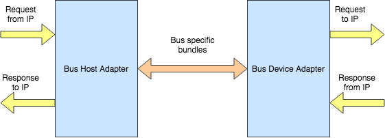

Communicating with the User's IP
================================

Inside the ``main/scala/caravan/bus/common/Transaction.scala`` there are two `abstract` classes defined ``AbstrRequest``
and ``AbstrResponse``. The purpose of these classes is to provide a common interface for the bus adapters to
communicate with the user's design.

The yellow arrows indicates the common bundles that each bus adapter uses to communicate with the user's IP. While
the orange bundle indicates the protocol specific bus bundles between bus adapters.

.. code-block:: scala

    abstract class AbstrRequest extends Bundle {
        val addrRequest: UInt
        val dataRequest: UInt
        val activeByteLane: UInt
        val isWrite: Bool
    }

This class provides a standardized way for the user's IP to send a request to the specific bus adapter or vice versa
as shown above in the diagram. Since this is an `abstract` class, a `concrete` class is required to implement its
fields which is usually done by a bus protocol specific class.

For example here is how the `Wishbone` implementation extends this class in the
``main/scala/caravan/bus/wishbone/WishboneBus.scala`` file:

.. code-block:: scala

    class WBRequest(implicit val config: WishboneConfig) extends AbstrRequest {
        override val addrRequest: UInt = UInt(config.addressWidth.W)
        override val dataRequest: UInt = UInt(config.dataWidth.W)
        override val activeByteLane: UInt = UInt((config.dataWidth/config.granularity).W)
        override val isWrite: Bool = Bool()
    }

It sets the fields according to the parameterized widths it gets from its own ``config`` file
present in ``main/scala/caravan/bus/wishbone/WishboneConfig.scala``

.. code-block:: scala

    case class WishboneConfig
    (
    /**
    * addressWidth: the address width in bits
    * dataWidth: the data width in bits
    * granularity: the minimal data transfer size over the bus
    * waitState: whether the host can produce wait states during the bus transfer cycle
    */
    addressWidth: Int,
    dataWidth: Int,
    granularity: Int = 8,
    waitState: Boolean = false
    ) extends BusConfig

Similarly, the `abstract` response class present here ``main/scala/caravan/bus/common/Transaction.scala`` :

.. code-block:: scala

    abstract class AbstrResponse extends Bundle {
        val dataResponse: UInt
        val error: Bool
    }

is used by the bus protocol specific adapter to send response or error back to the user's IP or vice versa as shown in the
diagram above. It is concretely implemented by the Wishbone specific implementation here: ``main/scala/caravan/bus/wishbone/WishboneBus.scala``

.. code-block:: scala

    class WBResponse(implicit val config: WishboneConfig) extends AbstrResponse {
        override val dataResponse: UInt = UInt(config.dataWidth.W)
        override val error: Bool = Bool()
    }
